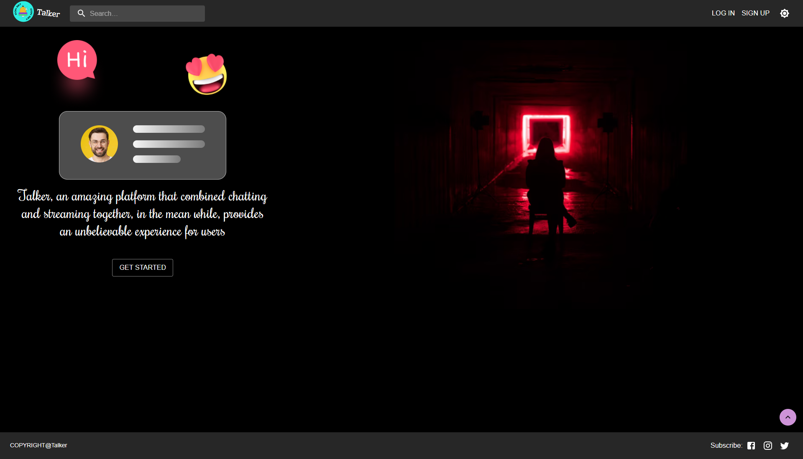

# fall-2021-project-group-centric-social-network-team-11

## App View

## Deployment

- Heroku: [https://fall-2021-social-network.herokuapp.com/](https://fall-2021-social-network.herokuapp.com/)

## Links:

- Wiki Page: [https://github.com/cis557/fall-2021-project-group-centric-social-network-team-11/wiki](https://github.com/cis557/fall-2021-project-group-centric-social-network-team-11/wiki)
- Figma Wireframes [https://www.figma.com/file/c5eObQUG9VhhMeD6Tt3JMj/Project?node-id=0%3A1](https://www.figma.com/file/c5eObQUG9VhhMeD6Tt3JMj/Project?node-id=0%3A1)
- Swagger API Documentation: [https://app.swaggerhub.com/apis-docs/jhe2021/CIS557_Project/1.0.0#/](https://app.swaggerhub.com/apis-docs/jhe2021/CIS557_Project/1.0.0#/)
- Swagger API Editor: [https://app.swaggerhub.com/apis/jhe2021/CIS557_Project/1.0.0#/](https://app.swaggerhub.com/apis/jhe2021/CIS557_Project/1.0.0#/)

## Instructions

- To get started, please do the following steps:
    1. git clone this repository. You can simply choose a directory on your computer and open a command prompt and run `git clone https://github.com/cis557/fall-2021-project-group-centric-social-network-team-11.git`
    1. cd into the folder `cd fall-2021-project-group-centric-social-network-team-11`
    1. Run command `npm run build` to install all the dependencies for both front end client and back end server as well as build a optimized front end app ready for serving
    1. Run command `npm start` to start the server
    1. Open your browser and type in`[http://localhost:5000](http://localhost:5000)` to view the frond end app if the server is running on the same host of the browser. If you are not running the server locally, please use `[http://ip:5000](http://ip:5000)` or `[https://yourDomain:5000](https://yourDomain:5000)` to access the app. We strongly encourage you to use our app through `https` on the Internet to prevent potential safety issues.
    1. Play around with the app, and HAVE FUN!
